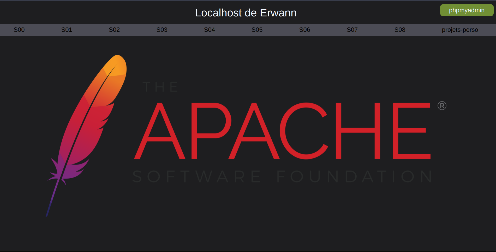
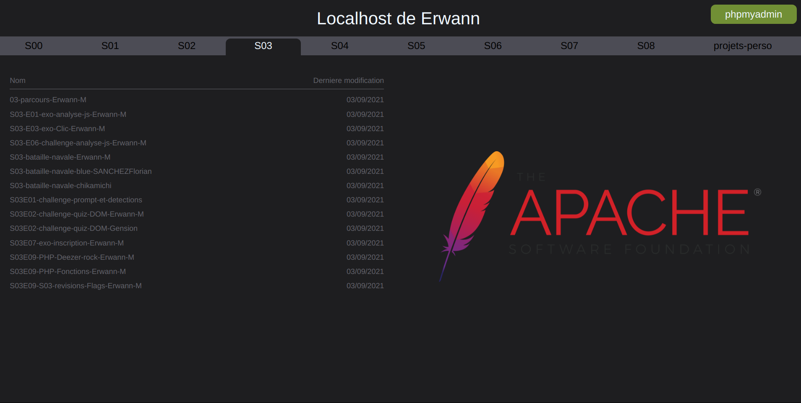

# localhost-stylesed

Hi ! Welcome to my localhost styling project.

Are you sick of the ugly localhost?
I have the solution ! :wink:

Home


On directory


## Customization

- Go on ```theme-localhost/style/style.css```.
- Modify colors and all that you want.
- Go on ``` index.php ``` and ```index-rename-me.php```.
- Modify your name, your favorite data base manager and all that you want.
- Modify the files to be excluded.
- If you want to modify image, go to ```index.php``` and modify

## install

- Clone this repository.
- Paste ```index.php``` and ```localhost-style``` on the root directory of your localhost.
- Rename ```index-rename-me.php``` in ```index.php```.
- And Paste this new index.php in all the directories that you want to modify style.

Enjoy your life !
